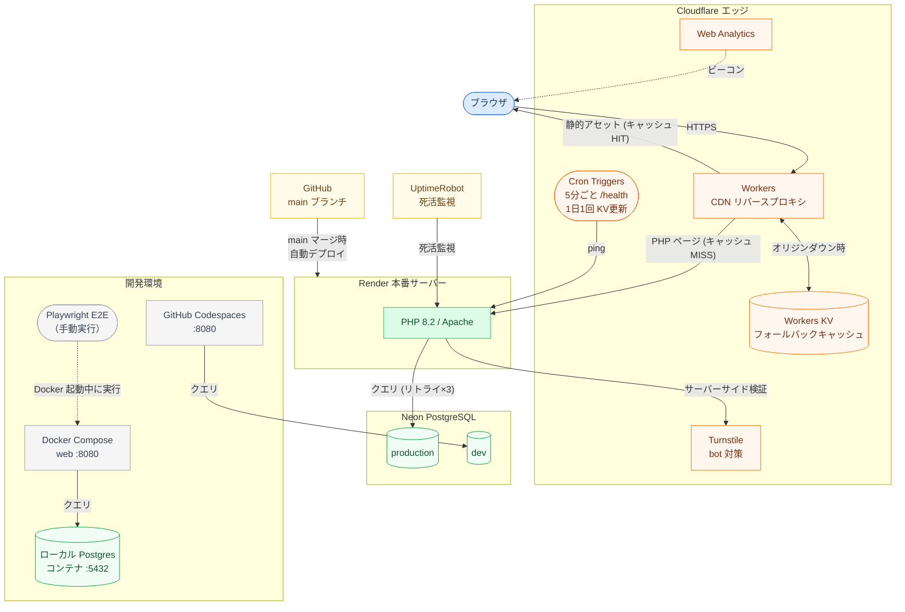

# 雀魂部屋主催 - 麻雀トーナメント戦績サイト

雀魂（じゃんたま）で開催する身内向け麻雀トーナメントの戦績サイト。最強位戦・鳳凰位戦・マスターズ・百段位戦・プチイベントなど複数の大会種別に対応する。

- **本番**: https://jantama-records-proxy.aokyun1031.workers.dev/
- **オリジン**: https://jantama-records.onrender.com/

> コーディング規約・Claude Code 向けの作業ルールは [`CLAUDE.md`](./CLAUDE.md) を参照。

---

## 目次

- [クイックスタート](#クイックスタート)
- [アーキテクチャ](#アーキテクチャ)
- [ディレクトリ構成](#ディレクトリ構成)
- [ページ遷移](#ページ遷移)
- [開発環境](#開発環境)
- [データベース](#データベース)
- [E2Eテスト](#e2eテスト)
- [デプロイ](#デプロイ)
- [Cloudflare 連携](#cloudflare-連携)
- [開発ツール](#開発ツールclaude-code)
- [関連ドキュメント](#関連ドキュメント)

---

## クイックスタート

開発環境は用途で使い分ける。

| 環境 | 接続先 DB | 想定用途 |
|---|---|---|
| **Docker Compose（ローカル）** | ローカル Postgres コンテナ | 通常の開発。Neon compute を消費しない |
| **GitHub Codespaces** | Neon dev ブランチ | クラウド IDE / 外出先 / 共有検証 |

### Docker Compose（ローカル・推奨）

`.env.example` のデフォルト接続先がローカル Postgres コンテナ（`db` サービス）。追加設定不要でそのまま起動可能。

```bash
cp .env.example .env              # そのままローカルDB接続（Turnstileキーは必要なら編集）
cp phinx.php.example phinx.php
docker compose up -d              # web + db 起動（db 初回起動時に current_schema.sql 自動適用）
docker compose exec web composer install
docker compose exec web php vendor/bin/phinx seed:run   # db/seed_data.sql を投入
```

`http://localhost:8080` でアクセス可能。DB データは Docker volume `pgdata` に永続化。

ローカル DB は **マイグを実行しない**方針（古いマイグが本番 init.sql 前提で空 DB では通らないため）。スキーマは pg_dump 由来の `db/current_schema.sql`、データは `db/seed_data.sql` を `DevDataSeeder` が流す。`phinx seed:run` は何度でも実行でき、テストデータを壊しても完全復元できる。詳細 → [`docs/local-dev-seed.md`](./docs/local-dev-seed.md)。

### GitHub Codespaces

1. リポジトリ → **Code** → **Codespaces** → **Create codespace**
2. 初回起動時に `.devcontainer/setup.sh` が自動実行され、PHP拡張インストール・`composer install`・`phinx.php`・`.env` 作成まで完了する
3. `DATABASE_URL` に **Neon dev ブランチ** の接続文字列を設定（**Codespaces Secrets** 推奨。GitHub → Settings → Codespaces → Secrets）+ `PGSSLMODE=require`
4. ポート `8080` の地球儀アイコン（Open in Browser）をクリック

---

## アーキテクチャ

```
本番:  Cloudflare Workers ──→ Render ──→ Neon (production)
開発:  Docker Compose ──→ ローカル Postgres（コンテナ / volume 永続化）
開発:  Codespaces     ──→ Neon (dev ブランチ)
```



### 技術スタック

| 領域 | 使用技術 |
|---|---|
| アプリケーション | PHP 8.2 / Apache |
| フロントエンド | HTML / CSS / JavaScript（フレームワーク不使用）、Google Fonts（Noto Sans JP, Inter） |
| データベース | PostgreSQL（Neon） |
| マイグレーション | Phinx |
| ホスティング | Render（本番）、Docker Compose / GitHub Codespaces（開発） |
| エッジ/CDN | Cloudflare Workers、Workers KV、Cron Triggers |
| セキュリティ | Cloudflare Turnstile（bot 対策） |
| 解析 | Cloudflare Web Analytics |
| 監視 | UptimeRobot |
| テスト | Playwright（E2E） |

本番は Neon production、Codespaces は Neon dev、ローカル Docker は Postgres コンテナ（volume `pgdata` で永続化）。Neon 無料枠のスリープ復帰を考慮し、DB接続はリトライ付き（最大3回・指数バックオフ）。

---

## ディレクトリ構成

```
├── public/            Webサーバー公開ディレクトリ（DocumentRoot）
│   ├── css/           スタイルシート
│   ├── js/            JavaScript
│   └── img/           画像
├── models/            データアクセス層（SQLはここに集約）
├── enums/             PHP enum（定数定義・値オブジェクト）
├── config/            DB接続・ヘルパー関数
├── templates/         共通ヘッダー・フッター
├── db/migrations/     Phinxマイグレーション
├── db/seeds/          Phinxシーダー
├── tests/e2e/         E2Eテスト（Playwright）
├── cloudflare-worker/ Cloudflare Workerリバースプロキシ
├── docs/              ドキュメント（DB設計書等）
└── .devcontainer/     GitHub Codespaces設定
```

`public/` のみがWebサーバーから公開される。`config/`、`models/`、`enums/`、`templates/`、`db/`、`vendor/` は Web 経由でアクセス不可。

---

## ページ遷移

```
index.php（トップ）
  ├→ players.php（選手一覧）
  │    ├→ player_new.php（選手登録）
  │    └→ player.php（選手詳細）
  │         ├→ player_edit.php（選手編集・削除）
  │         ├→ player_tournament.php（大会別戦績）
  │         └→ player_analysis.php（戦績分析）
  ├→ tournaments.php（大会一覧）
  │    ├→ tournament_new.php（大会作成）
  │    └→ tournament.php（大会管理）
  │         ├→ tournament_edit.php（大会情報編集）
  │         ├→ tournament_players.php（選手登録）
  │         ├→ table_new.php（卓作成）
  │         ├→ table.php（卓管理：日程・牌譜URL・結果登録・完了）
  │         └→ interview_edit.php（優勝インタビュー設定・大会完了）
  ├→ tournament_view.php（大会結果閲覧）
  └→ interview.php（優勝インタビュー）
```

---

## 開発環境

### GitHub Codespaces

Codespaces 起動時に PHP ビルトインサーバー（ポート 8080）が自動で立ち上がる。ブラウザで確認するには VS Code 下部パネルの「**ポート**」タブでポート `8080` の地球儀アイコンをクリック。URL 形式: `https://<codespace名>-8080.app.github.dev`。

PHPサーバーが停止した場合:

```bash
php -S 0.0.0.0:8080 -t public
```

### Docker Compose

```bash
docker compose up -d              # web + db(postgres) 起動
docker compose down               # 停止（volume pgdata は保持）
docker compose down -v            # 停止 + DB データ削除（リセット）
docker compose exec web bash      # web コンテナに入る
docker compose exec db psql -U postgres jantama  # ローカルDBへ psql 接続
```

ホスト側から直接 DB を覗く場合は `psql -h localhost -U postgres -d jantama`（パスワード `postgres`）。

---

## データベース

### Phinx（マイグレーション）

```bash
# Codespaces内
php vendor/bin/phinx status              # ステータス確認
php vendor/bin/phinx migrate             # マイグレーション実行
php vendor/bin/phinx seed:run            # シーダー実行
php vendor/bin/phinx create AddNewColumn # 新規マイグレーション作成
php vendor/bin/phinx rollback            # ロールバック

# Docker内
docker compose exec web php vendor/bin/phinx status
docker compose exec web php vendor/bin/phinx migrate
docker compose exec web php vendor/bin/phinx seed:run
```

既存 DB を Phinx 管理下に置く場合（`init.sql` 適用済み環境）:

```bash
php vendor/bin/phinx migrate --fake
```

### 接続先 DB の使い分け

| 環境 | 接続先 | `.env` 設定 | スキーマ構築 | データ |
|---|---|---|---|---|
| Render（本番） | Neon production | Render 管理画面の環境変数 | `phinx migrate`（start.sh 自動） | 本番データ |
| GitHub Codespaces | Neon dev ブランチ | `DATABASE_URL=postgresql://...neon.tech/...?sslmode=require` / `PGSSLMODE=require` | 既存のまま（Neon dev は production から派生） | dev ブランチのデータ |
| Docker Compose（ローカル） | ローカル Postgres コンテナ | `DATABASE_URL=postgresql://postgres:postgres@db:5432/jantama` / `PGSSLMODE=disable` | `db/current_schema.sql` を initdb.d で自動適用 | `phinx seed:run` で `db/seed_data.sql` を流す |

`.env.example` にはローカル接続をデフォルトで記載、Neon dev 用はコメントで併記。`config/database.php` と `phinx.php` は両方とも `DATABASE_URL` + `PGSSLMODE` を読むため、環境変数切替のみで動作する。

### ローカル Postgres コンテナ

```bash
docker compose up -d                 # web + db 起動（初回は db が自動でスキーマ適用）
docker compose exec web php vendor/bin/phinx seed:run  # テストデータ投入（何度でも可）
docker compose down -v               # DB データ完全削除
docker compose up -d                 # 再起動すればスキーマ再構築
```

- image: `postgres:17-alpine`（Neon と同バージョン）
- 永続化: Docker volume `pgdata`
- 資格情報: `postgres` / `postgres` / db `jantama`
- ホスト公開ポート: `5432`（`psql -h localhost -U postgres -d jantama` で接続可）
- **マイグ不実行**: ローカルでは `start.sh` をバイパス（`command: apache2-foreground`）。スキーマは dump、データは seed で管理
- テストデータ更新手順 → [`docs/local-dev-seed.md`](./docs/local-dev-seed.md)

### Neon ブランチ運用

```
Neon production (default) ← Render 本番が接続
Neon dev                  ← Codespaces が接続
```

#### 開発フロー

1. feature ブランチで開発・テスト
2. E2E テスト通過を確認
3. PR を作成し main ブランチにマージ

#### Neon dev ブランチの初期化（必要な場合のみ）

本番データと同期したい場合、Neon ダッシュボードで dev ブランチを削除し、production から再作成する。

---

## E2Eテスト

Playwright による自動テスト。Docker 起動中に実行する。

```bash
# 初回セットアップ
cd tests/e2e && npm install && npx playwright install chromium --with-deps

# テスト実行
npx playwright test              # 全テスト
npx playwright test --headed     # ブラウザ表示あり
npx playwright test pages/       # ページテストのみ
npx playwright test features/    # 機能テストのみ
npx playwright test --ui         # UIモード
```

push 前に各自で `cd tests/e2e && npx playwright test` を手動実行する運用。

| ディレクトリ | 内容 |
|---|---|
| `tests/e2e/pages/` | ページ別テスト（表示・CRUD・バリデーション・404） |
| `tests/e2e/features/` | 機能テスト（テーマ切替・クリーンURL・セキュリティ・ナビゲーション） |
| `tests/e2e/helpers/` | 共通ユーティリティ（カスタム fixture・テストプレイヤー管理） |

---

## デプロイ

### 本番（自動）

main にマージされると以下が自動実行される（手動操作不要）:

1. **Render**: Docker イメージのビルド → `phinx migrate` → Apache 起動
2. **Cloudflare Workers**: 変更不要（Render へのプロキシなので PHP・CSS・JS の変更はそのまま反映される）

> **注意**: main への短時間の連続 push は避ける。push 毎に Render の再デプロイが走り、その間サイトがダウンする。

### Cloudflare Worker（手動）

`cloudflare-worker/src/index.js` または `wrangler.toml` を変更した場合のみ必要:

```bash
cd cloudflare-worker
npm install
npx wrangler login      # 初回のみ
npx wrangler deploy
```

| 変更内容 | Workerデプロイ | 備考 |
|---|---|---|
| PHP（ページ追加・修正） | 不要 | Render に自動反映 |
| CSS / JS / 画像 | 不要 | `asset()` のバージョニング（`?v=`）でキャッシュが自動更新 |
| Worker コード（`index.js`） | **必要** | `npx wrangler deploy` |
| `wrangler.toml`（設定変更） | **必要** | 同上 |

---

## Cloudflare 連携

### Workers（CDN リバースプロキシ）

静的アセット（CSS / JS / 画像）を Cloudflare のエッジにキャッシュする。

- 静的アセット → エッジキャッシュ（`CF-Cache-Status: HIT`）
- PHP ページ → キャッシュせず Render に転送（`Cache-Control: no-store`）
- Cron Triggers → 5 分ごと `/health` ping（Render スリープ防止・DB 非依存で Neon compute 消費なし）+ JST 3:00 にトップページ HTML を KV に更新
- Workers KV → オリジンダウン時にトップページのフォールバック表示
- 無料枠: 10 万リクエスト/日

### Turnstile（bot 対策）

全フォームページにウィジェット埋め込み済み。

- サーバーサイド検証: `validatePost()`（`config/security.php`）で CSRF + Turnstile を一括検証
- 環境変数: `TURNSTILE_SITE_KEY` / `TURNSTILE_SECRET_KEY`（`.env` および Render 管理画面）
- CSP に `https://challenges.cloudflare.com`（script + iframe）許可済み
- ダッシュボード: https://dash.cloudflare.com → Turnstile

### Web Analytics

全ページのフッターにビーコン埋め込み済み（`templates/footer.php`）。Workers URL / Render URL どちらのアクセスも収集される。

- PV 数・ユニークビジター・ページ別アクセス・リファラー・国・デバイス等を確認可能
- Cookie 不使用（プライバシーバナー不要）
- CSP に `https://static.cloudflareinsights.com`（script）と `https://cloudflareinsights.com`（データ送信）許可済み
- ダッシュボード: https://dash.cloudflare.com → Web Analytics

---

## 開発ツール（Claude Code）

Claude Code 用の skill / slash command / agent / hook を `.claude/` に配置している。

| 入口 | 例 | 用途 |
|---|---|---|
| slash command | `/refactor`, `/security-check`, `/migration-new` | 定型タスク起動 |
| skill | `add-page`, `testing`, `security` ほか | AI が文脈で自動参照する規約集 |
| agent | `php-reviewer` | セキュリティ／規約違反の専門レビュー |
| hook | `php-lint.sh` | Write/Edit 時に PHP 構文チェック |

セットアップ・使い方・ワークフロー・トラブルシューティング → [`.claude/README.md`](./.claude/README.md)

---

## 関連ドキュメント

| ドキュメント | 内容 |
|---|---|
| [`CLAUDE.md`](./CLAUDE.md) | コーディング規約・作業ルール（Claude Code 向け正本） |
| [`.claude/README.md`](./.claude/README.md) | 開発者向け Claude Code ガイド（skill/command/agent/hook） |
| [`docs/`](./docs/) | DB 設計書・機能設計メモ |
| [`docs/database.md`](./docs/database.md) | DB 設計書（ER 図・ビジネスルール・不変条件・全テーブル詳細） |
| [`docs/local-dev-seed.md`](./docs/local-dev-seed.md) | ローカル Postgres コンテナのスキーマ/seed 運用と dump 更新手順 |
