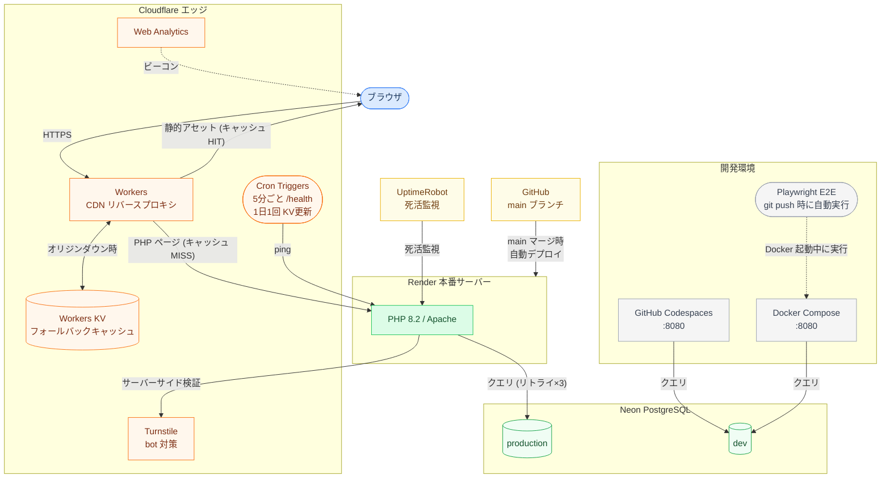

# 雀魂部屋主催 - 麻雀トーナメント戦績サイト

雀魂（じゃんたま）で開催する身内向け麻雀トーナメントの戦績サイトです。最強位戦・鳳凰位戦・マスターズ・百段位戦・プチイベントなど、複数の大会種別に対応しています。

## 技術スタック

- HTML / CSS / JavaScript（フレームワーク不使用）
- Google Fonts（Noto Sans JP, Inter）
- PHP 8.2（Apache）
- PostgreSQL（Neon）
- Phinx（DBマイグレーション）
- Docker Compose（ローカル開発）
- Render（ホスティング）
- GitHub Codespaces（開発環境）
- UptimeRobot（死活監視）
- Cloudflare Workers（CDNリバースプロキシ + Cron Triggersでスリープ防止 + Workers KVでフォールバック）
- Cloudflare Turnstile（bot対策）
- Cloudflare Web Analytics（アクセス解析）

## 環境構成

```
本番:  Cloudflare Workers ──→ Render ──→ Neon (productionブランチ)
開発:  Codespaces / Docker ──→ Neon (devブランチ)
```



Cloudflare Workers は CDN リバースプロキシとして動作し、静的アセット（CSS/JS/画像）をエッジにキャッシュします。
- Workers URL: `https://jantama-records-proxy.aokyun1031.workers.dev/`
- オリジン: `https://jantama-records.onrender.com/`

DBはすべてNeon（リモート）を使用します。ローカルにDBコンテナは不要です。
Neon無料枠のスリープからの復帰を考慮し、DB接続はリトライ付き（最大3回、指数バックオフ）で行います。

## ディレクトリ構成

```
├── public/          Webサーバー公開ディレクトリ（DocumentRoot）
│   ├── css/         スタイルシート
│   ├── js/          JavaScript
│   └── img/         画像
├── models/          データアクセス層（SQLはここに集約）
├── enums/           PHP enum（定数定義・値オブジェクト）
├── config/          DB接続・ヘルパー関数
├── templates/       共通ヘッダー・フッター
├── db/migrations/   Phinxマイグレーション
├── db/seeds/        Phinxシーダー
├── tests/e2e/       E2Eテスト（Playwright）
├── cloudflare-worker/ Cloudflare Workerリバースプロキシ
├── docs/            ドキュメント（DB設計書等）
└── .devcontainer/   GitHub Codespaces設定
```

`public/` のみがWebサーバーから公開されます。`config/`、`models/`、`enums/`、`templates/`、`db/`、`vendor/` はWeb経由でアクセスできません。

## ページ遷移

```
index.php（トップ）
  ├→ players.php（選手一覧）
  │    ├→ player_new.php（選手登録）
  │    └→ player.php（選手詳細）
  │         ├→ player_edit.php（選手編集・削除）
  │         ├→ player_tournament.php（大会別戦績）
  │         └→ player_analysis.php（戦績分析）
  ├→ tournaments.php（大会一覧）
  │    ├→ tournament_new.php（大会作成）
  │    └→ tournament.php（大会管理）
  │         ├→ tournament_edit.php（大会情報編集）
  │         ├→ tournament_players.php（選手登録）
  │         ├→ table_new.php（卓作成）
  │         ├→ table.php（卓管理：日程・牌譜URL・結果登録・完了）
  │         └→ interview_edit.php（優勝インタビュー設定・大会完了）
  ├→ tournament_view.php（大会結果閲覧）
  └→ interview.php（優勝インタビュー）
```

## 開発環境セットアップ

### GitHub Codespaces（推奨）

#### 初回セットアップ

1. GitHubリポジトリ → **Code** → **Codespaces** → **Create codespace**
2. 初回起動時に `.devcontainer/setup.sh` が自動実行され、以下が設定される:
   - PHP拡張（pdo_pgsql, pgsql）のインストール
   - `composer install` の実行
   - `phinx.php` の作成
   - `.env` の作成（Codespaces Secretsから `DATABASE_URL` を読み取り）
3. `DATABASE_URL` の設定（以下のいずれか）:
   - **Codespaces Secrets**（推奨）: GitHub → Settings → Codespaces → Secrets → `DATABASE_URL` を追加
   - **手動**: `.env` を編集して Neon devブランチの接続文字列を設定

#### 動作確認

Codespaces起動時にPHPビルトインサーバー（ポート8080）が自動で立ち上がります。

ブラウザで確認するには:

1. VS Code下部パネルの「**ポート**」タブをクリック
2. ポート `8080` の行にある **地球儀アイコン**（Open in Browser）をクリック

`https://<codespace名>-8080.app.github.dev` でページが表示されます。

#### PHPサーバーが停止した場合

```bash
php -S 0.0.0.0:8080 -t public
```

### Docker Compose（ローカル）

```bash
# 初期設定
cp .env.example .env
# .env にNeon devブランチの接続文字列とTurnstileキーを設定
cp phinx.php.example phinx.php

# 起動
docker compose up -d

# 依存パッケージのインストール
docker compose exec web composer install

# 停止・削除
docker compose down
```

起動後 `http://localhost:8080` でアクセスできます。

## Phinx（DBマイグレーション）

```bash
# Codespaces内
php vendor/bin/phinx status              # ステータス確認
php vendor/bin/phinx migrate             # マイグレーション実行
php vendor/bin/phinx seed:run            # シーダー実行
php vendor/bin/phinx create AddNewColumn # 新しいマイグレーション作成
php vendor/bin/phinx rollback            # ロールバック

# Docker内
docker compose exec web php vendor/bin/phinx status
docker compose exec web php vendor/bin/phinx migrate
docker compose exec web php vendor/bin/phinx seed:run
```

### 初回セットアップ（phinx導入前にinit.sqlでテーブル作成済みの環境）

既存のDBをPhinx管理下に置くには `--fake` を使います:

```bash
php vendor/bin/phinx migrate --fake
```

## Neonブランチ運用

```
Neon production (default) ← Render本番が接続
Neon dev                  ← 開発環境が接続
```

### 開発フロー

1. featureブランチで開発・テスト
2. E2Eテスト通過を確認
3. PRを作成し、mainブランチにマージ

### 本番デプロイ（mainにマージ後、自動で実行される）

mainにマージされると以下が自動実行される（手動操作不要）:

1. **Render**: Dockerイメージのビルド → `phinx migrate` → Apache起動
2. **Cloudflare Workers**: 変更不要（Renderへのプロキシなので、PHPやCSS/JSの変更はそのまま反映される）

> **注意**: mainへの短時間の連続pushは避ける。push毎にRenderの再デプロイが走り、その間サイトがダウンする。

### Cloudflare Worker のデプロイ（Workerのコードを変更した場合のみ）

`cloudflare-worker/src/index.js` を変更した場合のみ、手動デプロイが必要:

```bash
cd cloudflare-worker && npx wrangler deploy
```

### Neonブランチの初期化（必要な場合のみ）

Neon devブランチのデータをproductionと同期したい場合:

1. Neonダッシュボードでdevブランチを削除
2. productionからdevブランチを再作成（クリーンコピー）

## E2Eテスト

Playwright による自動テスト。Docker 起動中に実行する。

```bash
# 初回セットアップ
cd tests/e2e && npm install && npx playwright install chromium --with-deps

# テスト実行
npx playwright test              # 全テスト
npx playwright test --headed     # ブラウザ表示あり
npx playwright test pages/       # ページテストのみ
npx playwright test features/    # 機能テストのみ
```

`git push` 時に Claude Code の hook で自動実行される（Docker 未起動時はスキップ）。

| ディレクトリ | 内容 |
|---|---|
| `tests/e2e/pages/` | ページ別テスト（表示・CRUD・バリデーション・404） |
| `tests/e2e/features/` | 機能テスト（テーマ切替・クリーンURL・セキュリティ・ナビゲーション） |
| `tests/e2e/helpers/` | 共通ユーティリティ（カスタムfixture・テストプレイヤー管理） |

## リファクタリング

Claude 主導で開発を進めると、会話ごとに微妙な不整合（ドリフト）が積み上がる。
`/refactor` コマンドは CLAUDE.md 規約からのドリフトを検出・修正するための仕組み。

### 使い方

```bash
# Claude Code のスラッシュコマンド
/refactor                            # ヘルスチェック（読み取り専用）
/refactor public/player.php          # 指定ファイルのドリフトを修正
/refactor public/css/                # 指定ディレクトリ配下を修正

# スクリプト単体（CI や手動確認で使える）
bash .claude/skills/refactor/scripts/scan.sh             # 全体レポート
bash .claude/skills/refactor/scripts/scan.sh --summary   # 件数のみ
bash .claude/skills/refactor/scripts/scan.sh --target public/player.php
```

### 出力の読み方

| 深刻度 | 意味 | 対応 |
|---|---|---|
| 🔴 CRITICAL | セキュリティ / 規約の根幹に関わる | 即修正 |
| 🟡 WARNING | スタイル / 一貫性のドリフト | まとめて修正推奨 |
| 🔵 INFO | 検討余地あり（dead code・大きすぎるページ等） | 状況を見て判断 |

引数なしの `/refactor` はファイルを一切変更しない。修正は引数で対象を指定した時のみ実施される。
1 回の修正は **1 PR = 1 テーマ** に絞る（型キャスト修正とロジック変更を混ぜない）。

### 運用タイミング

- 大きな機能追加後（PR マージ前）
- 月次の整備タイミング
- 新規ページ作成後、既存ページとの一貫性を確認したい時

### 詳細

- 検出ルール一覧: `.claude/skills/refactor/conventions.md`
- スキル実装: `.claude/skills/refactor/SKILL.md`
- コーディング規約の正本: `CLAUDE.md`

## Cloudflare Workers（CDNリバースプロキシ）

静的アセット（CSS/JS/画像）をCloudflareのエッジにキャッシュするリバースプロキシ。

### 初回セットアップ

```bash
cd cloudflare-worker
npm install
npx wrangler login    # ブラウザでCloudflareにログイン
npx wrangler deploy   # デプロイ
```

### いつデプロイが必要か

| 変更内容 | Workerデプロイ | 備考 |
|---------|---------------|------|
| PHP（ページ追加・修正） | 不要 | Renderに自動反映 |
| CSS / JS / 画像 | 不要 | `asset()` のバージョニング（`?v=`）でキャッシュが自動更新される |
| Workerコード（`index.js`） | **必要** | `cd cloudflare-worker && npx wrangler deploy` |
| `wrangler.toml`（設定変更） | **必要** | 同上 |

### 仕組み

- 静的アセット → Cloudflareエッジにキャッシュ（`CF-Cache-Status: HIT`）
- PHPページ → キャッシュせずRenderに転送（`Cache-Control: no-store`）
- Cron Triggers → 5分ごとに `/health` へping（Renderスリープ防止・DB非依存でNeon compute消費なし）+ JST 3:00にトップページHTMLをKVにキャッシュ更新
- Workers KV → オリジンダウン時にトップページのフォールバック表示
- 無料枠: 10万リクエスト/日

## Cloudflare Turnstile（bot対策）

全フォームページにTurnstileウィジェットを埋め込み済み。bot によるフォーム送信を防止する。

- サーバーサイド検証: `validatePost()`（`config/security.php`）でCSRF + Turnstile を一括検証
- 環境変数: `TURNSTILE_SITE_KEY` / `TURNSTILE_SECRET_KEY`（`.env` およびRender管理画面で設定）
- CSP に `https://challenges.cloudflare.com`（スクリプト + iframe）を許可済み
- ダッシュボード: https://dash.cloudflare.com → Turnstile

## Cloudflare Web Analytics（アクセス解析）

全ページのフッターにビーコンスクリプトを埋め込み済み（`templates/footer.php`）。Workers URL・Render URL どちらのアクセスも収集される。

- ダッシュボード: https://dash.cloudflare.com → Web Analytics
- PV数、ユニークビジター、ページ別アクセス、リファラー、国・デバイス等を確認可能
- Cookie不使用（プライバシーバナー不要）
- CSP に `https://static.cloudflareinsights.com`（スクリプト）と `https://cloudflareinsights.com`（データ送信）を許可済み
