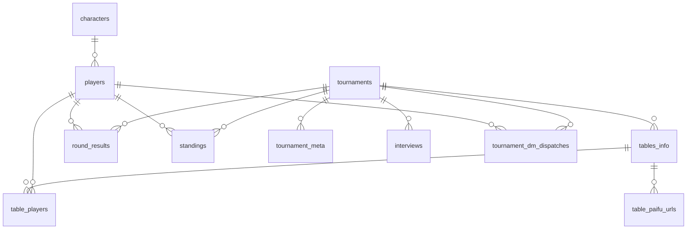

# データベース設計書

麻雀トーナメントの戦績管理システム。**設計意図・ビジネスルール・不変条件・各カラムの役割**を記述する。

> **真実の源（Source of Truth）**
> - スキーマ定義（型・NOT NULL・DEFAULT・インデックス・FK） → [`db/current_schema.sql`](../db/current_schema.sql)
> - モデル層 API → [`.claude/skills/data-model/SKILL.md`](../.claude/skills/data-model/SKILL.md)
> - マイグ履歴 → `git log db/migrations/`
> - ローカル DB 運用 → [`local-dev-seed.md`](./local-dev-seed.md)
>
> このドキュメントは **「なぜ」** と **「どう使うか」** を記述する。機械的に取れる情報（型など）は書かない（rot 防止）。

## 概要

- 複数大会を `tournaments` で一元管理。全派生データは `tournament_id` で分離
- 選手は `players`（`characters` マスタへの FK で雀魂キャラ紐付け）
- 大会進行単位 = 回戦（`round_number`）。回戦内に複数の対局卓（`tables_info`）
- 対局半荘単位 = `game_number`（1 対局卓で複数半荘打つケースに対応）
- 結果は追記型。遡っての変更手段は用意しない

## ER 図

リレーションのみ示す。カラム定義は [`db/current_schema.sql`](../db/current_schema.sql) および本ドキュメント下部「テーブル詳細」を参照。



**FK 削除挙動**: `characters → players` のみ `SET NULL`（キャラ削除で選手行を消さない）。それ以外は全て `CASCADE`。

## ビジネスルール

### 大会

- `tournaments.status`: `in_progress` / `completed` 等。運営が設定
- 全派生データは `tournament_id` で大会スコープ。大会削除で CASCADE 全削除
- イベント種別（最強位戦・鳳凰位戦・マスターズ・百段位戦・プチイベント）は `tournament_meta` の `event_type` キーに保持。enum `EventType` で統一

### 進行

複数回戦の敗退制トーナメント。各回戦でボーダー（カットオフ）を設定し、下回った選手は以降の回戦に出ない。

```
例:
1 回戦: 20 名 → 5 卓(4×5) → 16 名通過
2 回戦: 16 名 → 4 卓(4×4) → 12 名通過
3 回戦: 12 名 → 3 卓(4×3) →  4 名通過
決 勝:  4 名 → 1 卓        →  優勝決定
```

- 1 卓は必ず 4 名（麻雀ルール）
- 通過/敗退の判定は `standings.eliminated_round` に記録（回戦単位）
- カットオフの閾値は DB に保存しない。運営が判断し結果のみ記録

### スコア

- 1 桁小数（例: `82.5`, `-72.8`）。正負どちらも取り得る
- 1 対局卓で複数半荘打つ場合 `round_results` は `game_number` で分けて記録
- `standings.total` = その大会内で本人が参加した全 `round_results.score` の合計
- `standings.rank` = `total` 降順

### 敗退と残留

| `eliminated_round` | 意味 |
|---|---|
| `0` | 残留中（決勝進出者・優勝者含む） |
| `N` (> 0) | N 回戦で敗退 |

- 敗退しても `players` からは削除しない（履歴保持）
- 敗退した選手は以降の回戦の `table_players` に追加しない

### 対局卓

- `tables_info.done = true` で対局完了扱い
- `table_players.seat_order` (1–4) は着席位置
- 牌譜 URL は `table_paifu_urls` に半荘 (`game_number`) ごとに保存

### インタビュー

優勝者インタビュー Q&A を `interviews` に順序付きで保持（`sort_order`）。大会に紐づくので CASCADE 削除。

## データライフサイクル

```
[大会作成]
  → tournaments INSERT (status='in_progress')
  → tournament_meta INSERT (total_players, event_type 等)
  → 参加選手は tournaments 作成時に決定（players は事前に登録済み）

[各回戦]
  1. tables_info INSERT (tournament_id, round_number, done=false)
  2. table_players INSERT (卓と選手の結び付け)
  3. 対局実施
  4. round_results INSERT (tournament_id, player_id, round_number, game_number, score)
  5. tables_info UPDATE (done=true)
  6. standings を再計算 (total・rank・eliminated_round)
  7. tournament_meta.current_round / remaining_players を更新
  ↓ 通過者のみ次回戦

[大会終了]
  → tournaments.status を 'completed'
  → interviews を登録（任意）
```

## 不変条件

| 制約 | 保証方法 |
|---|---|
| 同一大会・同一選手・同一回戦・同一半荘のスコアは 1 件 | `round_results_unique_game` UNIQUE (`tournament_id`, `player_id`, `round_number`, `game_number`) |
| 1 大会につき 1 選手 1 standings レコード | `standings_pkey` PRIMARY KEY (`tournament_id`, `player_id`) |
| 1 大会につき同一キーは 1 件 | `tournament_meta_pkey` PRIMARY KEY (`tournament_id`, `key`) |
| 同一卓・同一半荘の牌譜 URL は 1 件 | `table_paifu_urls_table_id_game_number_key` UNIQUE |
| 選手名・キャラ名は全体で一意 | `players_name_key` / `characters_name_key` UNIQUE |
| 結果を遡って改変しない | 運用ルール（仕組みとしては UPDATE 可能だが通常しない） |

## 命名規約

| 対象 | ルール | 例 |
|---|---|---|
| テーブル | snake_case / 複数形 | `players`, `round_results` |
| カラム | snake_case | `player_id`, `round_number` |
| FK 参照カラム | `{参照先単数形}_id` | `player_id`, `tournament_id` |
| PK 制約 | `{table}_pkey` | `tournaments_pkey` |
| UNIQUE 制約 | `{table}_{col}_key` / `{table}_{col1}_{col2}_key` | `players_name_key` |
| FK 制約 | `{table}_{col}_fkey` | `round_results_player_id_fkey` |
| boolean | 状態語（`is_*` / `done` / `pending`） | `done`, `pending` |

## `tournament_meta.key` の主要値

| key | 意味 |
|---|---|
| `total_players` | 総参加者数 |
| `current_round` | 現在の回戦 |
| `remaining_players` | 残留選手数 |
| `event_type` | イベント種別（`EventType` enum の値） |

大会記録（最高得点・最多トップ等）は DB に保存せず、`TournamentRecords::all()` が `round_results` から動的算出する（SSoT は round_results）。

## テーブル詳細

全 10 テーブル（`phinxlog` は Phinx 管理用のため除外）。カラムの型・NOT NULL・DEFAULT は [`db/current_schema.sql`](../db/current_schema.sql) を参照。ここでは **役割・意味・他カラムとの関係** を記述する。

### `tournaments` — 大会マスター

1 行 = 1 大会。全派生データ（卓・結果・順位・インタビュー）は `tournament_id` で紐付き、大会削除で CASCADE される。

| カラム | 役割・意味 |
|---|---|
| `id` (PK) | 大会 ID |
| `name` | 大会名（表示用） |
| `status` | `in_progress` / `completed` 等。運営が手動で遷移 |
| `created_at` | 作成タイムスタンプ |

### `players` — 選手マスター

1 行 = 1 選手。大会を跨いで継続利用される。敗退しても削除せず履歴保持。

| カラム | 役割・意味 |
|---|---|
| `id` (PK) | 選手 ID |
| `name` (UNIQUE) | 正式名称。全体で一意（重複登録防止） |
| `nickname` | 表示用の呼称。正式名称より砕けた呼び名を許容 |
| `character_id` (FK → `characters.id`) | 雀魂キャラ。`SET NULL` なのでキャラ削除しても選手は残る |
| `discord_user_id` (UNIQUE) | Discord ユーザーID（雪片ID）。OAuth2 連携または手動で紐付け。null 許可（未連携選手） |
| `discord_username` | Discord 表示名（`global_name` 優先、無ければ `username`）。OAuth 連携時にキャッシュ |

### `characters` — 雀魂キャラマスター

選手アイコン用の雀魂キャラ定義。運営が事前登録する参照データ。

| カラム | 役割・意味 |
|---|---|
| `id` (PK) | キャラ ID |
| `name` (UNIQUE) | キャラ名。全体で一意 |
| `icon_filename` | アイコン画像ファイル名（`public/images/characters/` 配下を想定）。null 許可 |

### `tables_info` — 対局卓

1 大会・1 回戦・1 卓に対して 1 行。1 卓で複数半荘打つ場合でも行は増えない（半荘は `game_number` で区別）。

| カラム | 役割・意味 |
|---|---|
| `id` (PK) | 卓 ID |
| `tournament_id` (FK) | 所属大会 |
| `round_number` | 何回戦か（1 始まり） |
| `table_name` | 卓名（例: `A卓`, `B卓`）。表示用 |
| `played_date` | 対局予定/実施日。null 許可（未定の時点で行を作成し得るため） |
| `day_of_week` | 曜日の文字列。`played_date` 設定時に併せて埋める UI 補助 |
| `played_time` | 開始時刻（例: `"21:00"`）。自由記述の文字列 |
| `done` | 対局完了フラグ。`false` の間はスコア未確定として扱う |

### `table_players` — 卓と選手の結び付け

1 卓に最大 4 名。卓が確定したタイミングで挿入される。

| カラム | 役割・意味 |
|---|---|
| `id` (PK) | 行 ID |
| `table_id` (FK) | 対局卓 |
| `player_id` (FK) | 選手 |
| `seat_order` | 着席位置（1–4）。東南西北の描画順に使う |

### `table_paifu_urls` — 牌譜 URL

1 卓の半荘ごとに 1 行。`(table_id, game_number)` で UNIQUE。

| カラム | 役割・意味 |
|---|---|
| `id` (PK) | 行 ID |
| `table_id` (FK) | 対局卓 |
| `game_number` | 半荘番号（default 1）。1 卓で複数半荘打つ場合に 2, 3... と増える |
| `url` | 雀魂牌譜 URL。空文字許可（任意入力） |

### `round_results` — 回戦・半荘単位のスコア

大会の全スコアの根幹。`(tournament_id, player_id, round_number, game_number)` で UNIQUE。

| カラム | 役割・意味 |
|---|---|
| `id` (PK) | 行 ID |
| `tournament_id` (FK) | 所属大会 |
| `player_id` (FK) | 選手 |
| `round_number` | 何回戦のスコアか |
| `game_number` | 半荘番号（default 1）。1 卓で複数半荘打つ場合に分ける |
| `score` | そのスコア。正負の 1 桁小数 |

### `standings` — 大会 × 選手 の順位サマリ

`round_results` から集計した派生データ。複合主キー `(tournament_id, player_id)` で 1 大会 1 選手 1 行。

| カラム | 役割・意味 |
|---|---|
| `tournament_id` (PK/FK) | 所属大会 |
| `player_id` (PK/FK) | 選手 |
| `rank` | 大会内順位（`total` 降順） |
| `total` | その選手の全回戦スコア合計 |
| `pending` | 結果確定待ちフラグ（途中集計用の予約フィールド）。現状の実装では常に `false` |
| `eliminated_round` | 敗退回戦（0 = 残留中、N = N 回戦で敗退） |

### `tournament_meta` — 大会メタ情報 (key-value)

`(tournament_id, key)` で主キー。可変な大会属性をスキーマ追加せずに保持する汎用領域。主要 key は本ドキュメント上部の表を参照。

| カラム | 役割・意味 |
|---|---|
| `tournament_id` (PK/FK) | 所属大会 |
| `key` (PK) | 属性名 |
| `value` | 属性値（文字列。数値も文字列として保存） |

### `interviews` — 優勝者インタビュー Q&A

完了大会のインタビュー記事。任意登録（登録しない大会もある）。

| カラム | 役割・意味 |
|---|---|
| `id` (PK) | 行 ID |
| `tournament_id` (FK) | 所属大会 |
| `sort_order` | 表示順（昇順で並べる） |
| `question` | 質問文 |
| `answer` | 回答文 |

### `tournament_dm_dispatches` — Discord DM 配信履歴

大会作成時に Discord DM で参加表明URLを送った履歴。`(tournament_id, player_id)` で一意。
「未配信選手のみ再送」「個別再送」で参照する。送信成功（`sent`）の選手は再送対象から除外。

| カラム | 役割・意味 |
|---|---|
| `tournament_id` (PK/FK) | 所属大会 |
| `player_id` (PK/FK) | 送信先選手 |
| `sent_at` | 最終送信時刻 |
| `status` | `sent` / `failed` / `no_discord_id` のいずれか（DM拒否設定や ID 未登録は `failed` / `no_discord_id`） |
